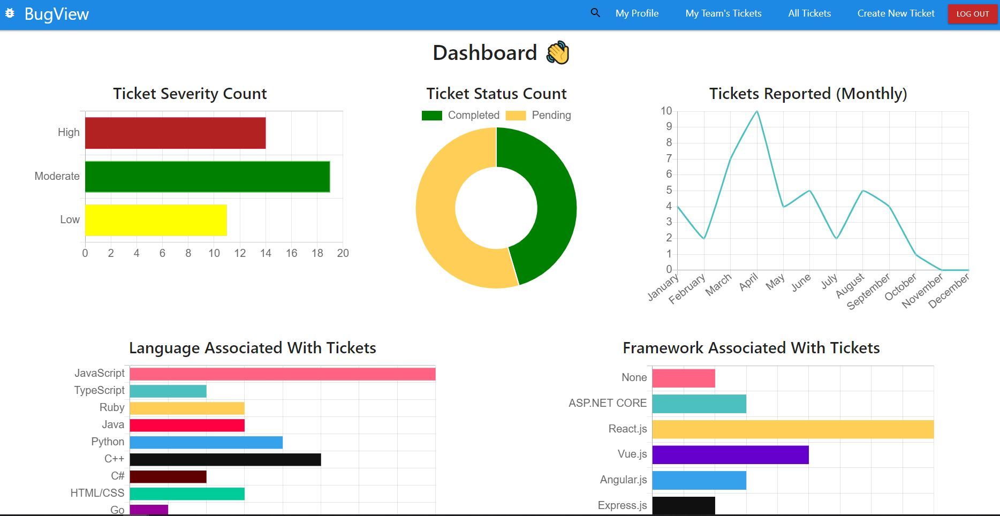
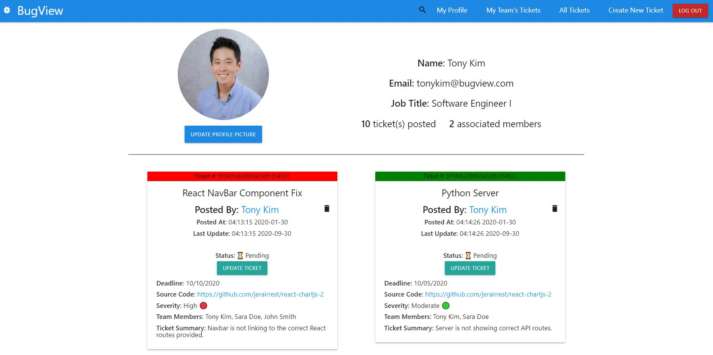

# BugView
> Bug tracking tool for every day use.  

## Table of contents
* [General info](#general-info)
* [Project Video](#project-video)
* [Technologies](#technologies)
* [Setup](#setup)
* [Features](#features)
* [Inspiration](#inspiration)
* [Contact](#contact)
* [License](#license)

## General info
BugView is a easy-to-use web application tool to track and manage bugs for any large or small scale project. This is a unique site that also integrates with data charts to better visualize team and tech stack performances. 

<div align="center">Welcome to BugView. </div>
<br/>
<div align="center">
<kbd>

</kbd>
</div>

<br/>
<div align="center">
<kbd>

</kbd>
</div>

## Project Video
[Click to view](https://youtu.be/1JKQrFFHDAQ)

## Technologies
### Backend Development 
* Node.js - version 14.6.0
* Express - version 4.17.1
* Express-Validator - version 6.6.1
* Config - version 3.3.2
* JWT - version 8.5.1
* Mongoose - version 5.10.0
* Request - version 2.88.2

### Frontend Development 
* JavaScript (ES6)
* HTML5
* CSS3
* React.js - version 16.13.1
* React-DOM - version 16.13.1
* React-Router-DOM - version 5.2.0
* React-Materialize - version 3.9.3
* React-Scripts - version 3.4.3
* Chart.js - version 2.9.3
* React-Chartjs-2 - version 2.10.0
* Material-UI - version 4.11.0
* Materialize-CSS - version 1.0.0

## Setup
To try out this project: 
1. Clone the GitHub repository locally to your computer
1. In the command line, navigate to the root directory of the repository, and type the following: 
  $ npm install 
1. Navigate to the client folder, and in the root directory of the client folder, type the following: 
  $ npm install 
1. In the client folder, and in the root directory of the client folder, type the following: 
  $ npm start
1. Navigate back to the root directory of this project "/GitConnect" and start the server by typing the following: 
  $ npx nodemon server 

## Code Examples
### Node.js/Express.js
```Node
//Route: PUT /comment 
//Details: User Comment Route 
//Access: Private 
router.put('/comment', requireLogin, (req, res) => {
    const comment = {
        text: req.body.text, 
        postedBy: req.user._id 
    }

    Post.findByIdAndUpdate(req.body.postId, {
        $push: {comments: comment}
    }, {
        new: true 
    })
    .populate('comments.postedBy', '_id firstName lastName date')
    .populate('postedBy', '_id firstName lastName date')
    .exec((err, result) => {
        if(err) {
            return res.status(422).json({ error: err })
        } else {
            res.json(result)
        }
    })
})
```

### JavaScript/React.js 
```React.js
useEffect(() => {
        if (image) {
            const data = new FormData()
            data.append('file', image)
            data.append('upload_preset', 'bugview')
            data.append('cloud_name', 'tk23')
            fetch('https://api.cloudinary.com/v1_1/tk23/image/upload', {
                method: 'POST', 
                body: data
            })
            .then(res => res.json())
            .then(data => {

                fetch('/updateimage', {
                    method: 'PUT',
                    headers: {
                        'Content-Type': 'application/json', 
                        'Authorization': 'Bearer ' + localStorage.getItem('jwt')
                    }, 
                    body: JSON.stringify({
                        image: data.url
                    })
                }).then(res => res.json())
                .then(result => {
                    localStorage.setItem('user', JSON.stringify({...state, image: result.image}))
                    dispatch({ type: 'UPDATEIMAGE', payload: result.image })
                    // window.location.reload()
                })
            })
            .catch(err => {
                console.log(err)
            })
        }
    }, [image])
```


## Features
* Full stack web application utilizing the MERN stack: MongoDB, Express.js, React, and Node.js. 
* Authorization and authenication implemented with JWT and bcrypt. 
* Front-End styles and chart components built with Materialize and Chart.js. 
* Users can create account through application. 
* Users can add profile information, profile image, and team members. 
* View and analyze ticket data through charts that includes: Ticket Severity Count, Pending/Completed Tickets, Frequency of Tickets Posted Per Month, Languages/Frameworks associated with Tickets.
* Create new tickets and update them as they get processed. 
* Add team members to your group to track tickets that you are associated with. 
* Interact with team members utilizing the comments feature. 

## Status
Project is: finished with option to expand functionality and DRY out code.

## Inspiration
The inspiration for BugView came as I worked through building large scale projects. With the increase in project scalability and remote work, I wanted to develop a bug tracking tool that allowed developers to easily track source code bugs in a easy-to-use format that allows collaborations with other team members. 

## Contact
Created by [Tony Kim](https://www.linkedin.com/in/hyung-kim/) 
Feel free to contact me for any questions! 

## License
[Click to view](https://github.com/hjkmines/BugView-MERN-Project/blob/master/LICENSE)